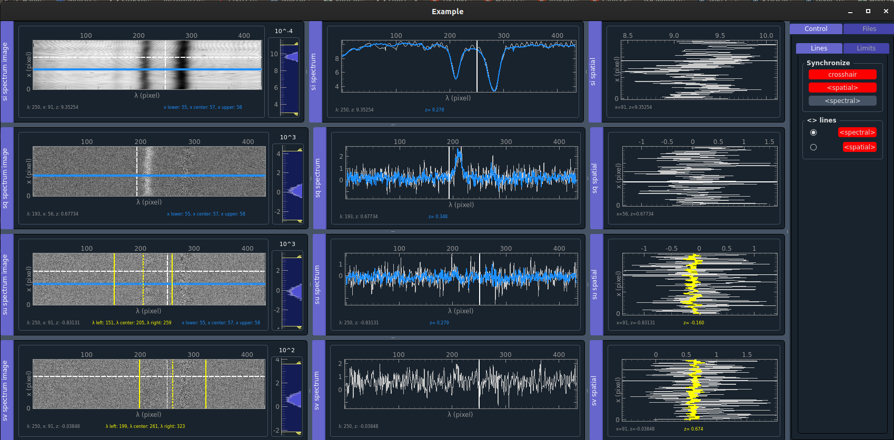

# Spectator - Spectropolarimetric Data Viewer

A modern Python-based data visualization application with advanced features for multi-dimensional spectropolarimetric data analysis.

## Table of Contents

- [About](#about)
- [Features](#features)
- [Installation](#installation)
- [Usage](#usage)
  - [Quick Start](#quick-start)
  - [Data Loading](#data-loading)
  - [Interactive Features](#interactive-features)
- [Architecture](#architecture)
- [Development](#development)
  - [Project Structure](#project-structure)
  - [Contributing](#contributing)
- [Requirements](#requirements)
- [License](#license)

## About

Spectator is a data viewer designed to replace and extent IDL Z3showred for the analysis and visualization of multi-dimensional spectropolarimetric data. Built with a modern Model-View-Controller (MVC) architecture, it provides interactive visualization capabilities for complex spectral datasets.
My idea is that you can provide numpy data arrays with up to 5 dimensions, where each dimension is of type "spatial", "spectral", "states" or "time". Depending on the combination of types, my Data manager will chose the correct viewer for you.



## Features

### Core Functionality
- **3D Data Support**: 3D numpy array with spectral, spatial and states
- **Interactive Crosshairs**: Synchronized navigation across multiple views to show the spectrum
- **Real-time Averaging**: Spectral and spatial averaging with visual feedback
- **Dynamic Data Scaling**: Per-state automatic scaling for optimal visualization

### Advanced Features
- **Flexible Data Loading**: Support for numpy arrays with arbitrary data structure (you can specify which axis belongs to which parameter, and a manager takes care of the correct display)
- **Synchronized Views**: Spectrum, spectrum image, and spatial profile windows
- **ZIMPOL data loading**: load a ZIMPOL file directly

### Future Features
- support more different types of data (e.g., 2D spectral/spatial, spatial/time, spectral/time, 3D, 4D, etc...)
- improve memory efficiency for large data sets
- should zooming and panning also be synchronizable?
- .fits file loading

## Installation

### Prerequisites

- Python 3.8 or higher
- Conda package manager (recommended)

### Environment Setup

1. **Create and activate the conda environment:**
   ```bash
   conda create -n spectator python=3.12
   conda activate spectator
   ```

2. **Install required packages:**
   ```bash
   conda install numpy pyqtgraph=0.13.2 qdarkstyle scipy
   pip install PyQt5  # or PyQt6
   ```

3. **Clone and navigate to the project:**
   ```bash
   git clone git@github.com:fzeuner/spectator.git
   cd spectator
   ```

4. **Stupid fix for pyqtgraph:**
   ```bash
   mv miniconda3/envs/spectator/lib/python3.12/site-packages/pyqtgraph/widgets/VerticalLabel.py miniconda3/envs/spectator/lib/python3.12/site-packages/pyqtgraph/widgets/VerticalLabel.py_bk
   cp utils/VerticalLabel.py miniconda3/envs/spectator/lib/python3.12/site-packages/pyqtgraph/widgets/
   mv miniconda3/envs/spectator/lib/python3.12/site-packages/pyqtgraph/dockarea/Dock.py miniconda3/envs/spectator/lib/python3.12/site-packages/pyqtgraph/dockarea/Dock.py_bk
   cp utils/Dock.py miniconda3/envs/spectator/lib/python3.12/site-packages/pyqtgraph/dockarea/
   ```

## Usage

### Quick Start

**Run the example application:**
```bash
conda activate spectator
python examples/spectator_example.py
```

This will generate synthetic 3D data and display it in the spectator viewer with multiple Stokes states.

### Data Loading

**Programmatic Usage:**
```python
from controllers.app_controller import display_data
import numpy as np

# Load your 3D data (states, spectral, spatial)
data = np.load('your_data.npy')

# Display with automatic axis detection
viewer = display_data(data, 'states', 'spectral', 'spatial', 
                     title='My Data', 
                     state_names=['I', 'Q', 'U', 'V'])
```

**ZIMPOL File Browser (if available):**
- Use the file listing controller to browse .dat files
- Automatic filtering for science data files

### Interactive Features

**Navigation:**
- **Crosshairs**: Move to navigate through spectral and spatial dimensions
- **Synchronized Views**: All windows update simultaneously for consistent data exploration
- **Zoom and Pan**: Mouse wheel and drag operations for detailed examination (not synchronized)

**Analysis Tools:**
- **Spectral Averaging**: Select wavelength ranges for averaged profiles
- **Spatial Profiles**: Extract 1D profiles at specific wavelengths
- **Real-time Labels**: Position and intensity values update dynamically
- **Per-state Scaling**: Automatic scaling optimizes visualization for each Stokes parameter

## Architecture

Spectator follows a **Model-View-Controller (MVC)** architecture pattern for maintainable and scalable code:

### Core Components

- **Models** (`models/`): Data structures and business logic
  - `SpectrumImageData`, `SpatialData`, `SpectrumData`: Core data models
  - `CrosshairState`, `AveragingRegion`: State management
  - `ViewerSettings`: Configuration management

- **Views** (`views/`): User interface components
  - `StokesSpectrumWindow`, `StokesSpectrumImageWindow`, `StokesSpatialWindow`: Main display windows
  - `SpectrumPlotWidget`, `SpectrumImageWidget`, `SpatialPlotWidget`: Reusable plot components
  - `BasePlotWidget`: Common functionality base class

- **Controllers** (`controllers/`): Application logic and coordination
  - `Manager`: High-level data management and scaling
  - `FileLoadingController`, `FileListingController`: File operations
  - `app_controller`: Main application entry point with `display_data()` function

## Development

### Project Structure

```text
spectator/
├── README.md
├── controllers/          # Application logic
│   ├── app_controller.py # Main entry point
│   ├── viewers.py        # Viewer creation
│   └── file_controllers.py
├── models/              # Data models
│   ├── spectrum_model.py
│   ├── data_model.py
│   └── viewer_config.py
├── views/               # UI components
│   ├── windows.py       # Main windows
│   ├── spectrum_widgets.py
│   └── base_widgets.py
├── utils/               # Utilities
│   ├── plotting.py
│   ├── colors.py
│   └── data_utils.py
└── examples/            # Example scripts
    └── spectator_example.py
### Contributing

1. **Fork the repository** and create a feature branch
2. **Follow the MVC pattern** when adding new functionality
3. **Test your changes** with the example script
4. **Update documentation** for new features
5. **Submit a pull request** with a clear description

### Development Guidelines

- **Code Style**: Follow PEP 8 conventions
- **Architecture**: Maintain separation of concerns (MVC)
- **Testing**: Test with various data shapes and formats
- **Performance**: Consider memory efficiency for large datasets

## Requirements

### Core Dependencies

- **Python**: 3.8+
- **NumPy**: Array operations and data handling
- **PyQtGraph**: High-performance plotting and visualization
- **PyQt5/PyQt6**: GUI framework
- **QDarkStyle**: Modern dark theme support

### Optional Dependencies

- **SciPy**: Advanced scientific computing features
- **Matplotlib**: Additional plotting capabilities (if needed)

### System Requirements

- **Memory**: 4GB+ RAM recommended for large datasets
- **Display**: 1920x1080+ resolution for optimal layout
- **OS**: Windows, macOS, or Linux

## License

This project is developed for scientific research purposes. Please contact the maintainers for licensing information.

## Acknowledgments

- **Original concept**: Replacement for IDL Z3showred by Franziska Zeuner
- **Architecture design**: Modern MVC pattern implementation, originally started by Denny Schwender, then complete redesign by Franziska Zeuner, added functionalities with Claude Sonnet 4.0
- **PyQtGraph team**: Excellent plotting library that makes this application possible
