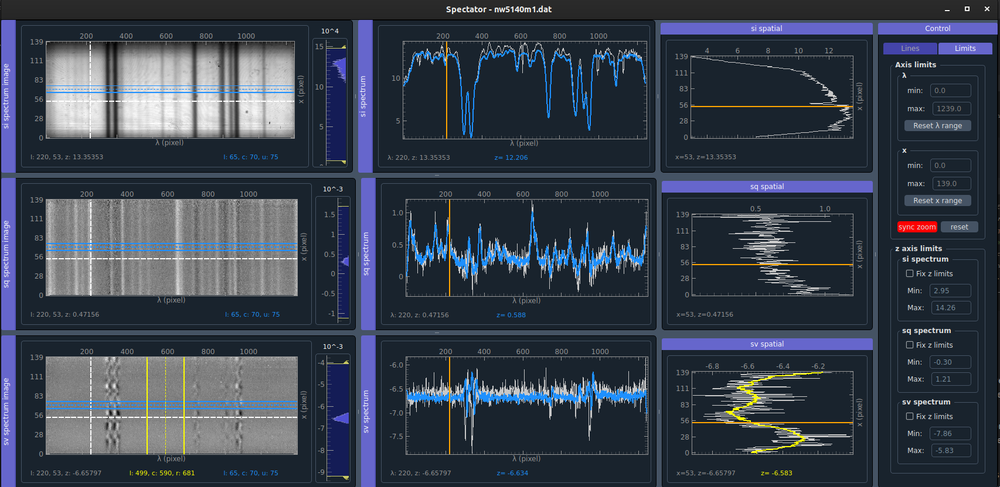

# Spectator - Spectropolarimetric Data Viewer

A modern Python-based data visualization application with advanced features for multi-dimensional spectropolarimetric data analysis.

## Table of Contents

- [About](#about)
- [Features](#features)
- [Installation](#installation)
- [Usage](#usage)
  - [Quick Start](#quick-start)
  - [Data Loading](#data-loading)
  - [Interactive Features](#interactive-features)
- [Configuration](#configuration)
- [Architecture](#architecture)
- [Development](#development)
  - [Project Structure](#project-structure)
  - [Contributing](#contributing)
- [Requirements](#requirements)
- [License](#license)

## About

Spectator is a data viewer designed to replace and extent IDL Z3showred for the analysis and visualization of multi-dimensional spectropolarimetric data. Built with a modern Model-View-Controller (MVC) architecture, it provides interactive visualization capabilities for complex spectral datasets.
My idea is that you can provide numpy data arrays with up to 5 dimensions, where each dimension is of type "spatial", "spectral", "states" or "time". Depending on the combination of types, my Data manager will chose the correct viewer for you.



## Features

### Core Functionality
- **3D Data Support**: 3D numpy array with spectral, spatial and states
- **Interactive Crosshairs**: Synchronized navigation across multiple views to show the spectrum
- **Real-time Averaging**: Spectral and spatial averaging with visual feedback
- **Dynamic Data Scaling**: Per-state automatic scaling for optimal visualization

### Feature Highlight: AveragingLineManager
- **Unified Averaging Lines**: `utils/averaging_lines.py` introduces `AveragingLineManager`, a reusable manager for both spectral (vertical) and spatial (horizontal) averaging lines.
- **Robust Syncing**: Signal blocking prevents recursion and feedback loops when syncing lines across windows.
- **Consistent UX**: Preserves averaging width while moving center/outer lines and applies orientation-specific logic uniformly.

### Advanced Features
- **Flexible Data Loading**: Support for numpy arrays with arbitrary data structure (you can specify which axis belongs to which parameter, and a manager takes care of the correct display)
- **Synchronized Views**: Spectrum, spectrum image, and spatial profile windows
- **ZIMPOL data loading**: load a ZIMPOL file directly
- **Single-sided wavelength limits**: You can set only min or only max in the controls; the other side auto-expands to data bounds.

### Future Features
- installation simplification with pyinstaller?
- support more different types of data (e.g., 2D spectral/spatial, spatial/time, spectral/time, 3D, 4D, etc...)
- improve memory efficiency for large data sets
- should zooming and panning also be synchronizable?
- how to make a monkey patch for the pyqtrgaph widgets Dock and VerticalLabel?
- .fits file loading
- add other viewers 

## Installation

### Prerequisites

- Python 3.8 or higher
- Conda package manager (recommended)

### Environment Setup

1. **Create and activate the conda environment:**
   ```bash
   conda create -n spectator python=3.12
   conda activate spectator
   ```

2. **Install required packages:**
   ```bash
   conda install numpy pyqtgraph qdarkstyle scipy
   pip install PyQt5  # or PyQt6
   ```

3. **Clonet:**
   ```bash
   git clone https://github.com/fzeuner/spectator.git
   ```

4. **Stupid fix for pyqtgraph:**
   ```bash
   mv miniconda3/envs/spectator/lib/python3.12/site-packages/pyqtgraph/widgets/VerticalLabel.py miniconda3/envs/spectator/lib/python3.12/site-packages/pyqtgraph/widgets/VerticalLabel.py_bk
   cp spectator/utils/VerticalLabel.py miniconda3/envs/spectator/lib/python3.12/site-packages/pyqtgraph/widgets/
   mv miniconda3/envs/spectator/lib/python3.12/site-packages/pyqtgraph/dockarea/Dock.py miniconda3/envs/spectator/lib/python3.12/site-packages/pyqtgraph/dockarea/Dock.py_bk
   cp spectator/utils/Dock.py miniconda3/envs/spectator/lib/python3.12/site-packages/pyqtgraph/dockarea/
   ```

5. **(Optional) Configure default data path:**
   - Edit `config/file_config.json` and set `"default_data_base_dir"` to your data root.
   - You can also set `"auto_navigate_recent": true` to auto-open the latest `YYMMDD` subdirectory.
   - Alternatively, create/update your user-local config at `~/.config/spectator/file_config.json` — this takes precedence over the repo-local file.
   - See the [Configuration](#configuration) section for details and other options.

6. ** (Optional) Create an alias for easy access of z3showred functionality:**
   ```bash
   echo "alias z3showred='~/spectator/z3showred.sh'" >> ~/.bashrc
   source ~/.bashrc
   # Then simply run: z3showred
   ```

## Usage

Spectator provides two main usage modes, mimicking the flexibility of the original IDL Z3showred:

### Mode 1: Standalone Viewer (Direct Data Display)

**Run the standalone viewer example:**
```bash
cd spectator
conda activate spectator
python examples/viewer_example.py
```

This generates synthetic 3D data and displays it directly in the spectator viewer with multiple Stokes states. Use this mode when you want to programmatically load and display data arrays.

### Mode 2: File Browser Mode (Z3showred-style)

**Run the file browser application:**
```bash
cd spectator
conda activate spectator
python examples/z3showred_example.py
# or use the shell script:
./z3showred.sh
```

This launches a file browser interface that mimics the original IDL Z3showred workflow, allowing you to browse and select `.dat` files for visualization. The file browser automatically filters for science data and provides an intuitive interface for data exploration.


**For convenience, you can create an alias:**
```bash
echo "alias z3showred='~/code/spectator/z3showred.sh'" >> ~/.bashrc
source ~/.bashrc
# Then simply run: z3showred
```

### Data Loading

**Programmatic Usage:**
```python
from controllers.app_controller import display_data
import numpy as np

# Load your 3D data (states, spectral, spatial)
data = np.load('your_data.npy')

# Display with automatic axis detection
# data.shape[0] should be 4, because 4 state names are given
viewer = display_data(data, 'states', 'spectral', 'spatial', 
                     title='My Data', 
                     state_names=['I', 'Q', 'U', 'V'])
```

**ZIMPOL File Browser (if available):**
- Use the file listing controller to browse .dat files
- Automatic filtering for science data files

## Configuration

Spectator reads configuration from a repo-local JSON file with sensible defaults.

- If a user-local config exists at `~/.config/spectator/file_config.json`, it is used.
- Otherwise, the repo-local `config/file_config.json` is used.

Config keys:

- `default_data_base_dir`: Absolute path to your base data directory (e.g., `/home/user/data/pdata`).
- `auto_navigate_recent`: If `true`, the file chooser auto-opens the most recent `YYMMDD` subdirectory.
- `must_be_in_directory`: Substring that must be present in subdirectory paths for `.dat` files to be listed (default: `"reduced"`).
- `excluded_file_terms`: Substrings; files containing any are excluded (e.g., `["cal", "dark", "ff"]`).

Example `config/file_config.json`:

```json
{
  "default_data_base_dir": "/home/you/data/pdata",
  "auto_navigate_recent": true,
  "must_be_in_directory": "reduced",
  "excluded_file_terms": ["cal", "dark", "ff"]
}
```

Minimal user-local override example (`~/.config/spectator/file_config.json`):

```json
{
  "default_data_base_dir": "/path/to/your/data"
}
```

Changing the user-local path (optional):

- Default user-local location is defined in `utils/config.py` as `USER_CONFIG_DIR`/`USER_CONFIG_PATH`.
- To customize, edit these constants in `utils/config.py`:

For example, to store the user config under `~/.spectator/` instead:

```python
# utils/config.py
USER_CONFIG_DIR = os.path.join(os.path.expanduser("~"), ".spectator")
USER_CONFIG_PATH = os.path.join(USER_CONFIG_DIR, "file_config.json")
```

### Interactive Features

**Navigation:**
- **Crosshairs**: Move to navigate through spectral and spatial dimensions
- **Synchronized Views**: All windows update simultaneously for consistent data exploration
- **Zoom and Pan**: Mouse wheel and drag operations for detailed examination (not synchronized)

**Analysis Tools:**
- **Spectral Averaging**: Select wavelength ranges for averaged profiles
- **Spatial Profiles**: Extract 1D profiles at specific wavelengths
- **Real-time Labels**: Position and intensity values update dynamically
- **Per-state Scaling**: Automatic scaling optimizes visualization for each Stokes parameter

## Architecture

Spectator follows a **Model-View-Controller (MVC)** architecture pattern for maintainable and scalable code:

### Core Components

- **Models** (`models/`): Data structures and metadata
  - `data_model.py`: Wraps loaded arrays and exposes (states, spectral, spatial) ordering
  - `file_model.py`: ZIMPOL file metadata and filtering helpers

- **Views** (`views/`): UI and plotting widgets
  - `windows.py`: Main windows (spectrum, spectrum image, spatial) and their wiring
  - `base_widgets.py`: Common plotting helpers and base UI pieces
  - `control_widgets.py`: Controls (limits, toggles, file browser)

- **Controllers** (`controllers/`): Coordination and app entry points
  - `app_controller.py`: `display_data()` entry, data updates, scaling, signal connections
  - `viewers.py`: Viewer construction and signal wiring
  - `file_controllers.py`: File list, filters, and selection handling

- **Utils** (`utils/`): Shared helpers
  - `averaging_lines.py`: `AveragingLineManager` for spectral/spatial averaging lines
  - `plotting.py`: Plot setup, range helpers, histograms, themes
  - `colors.py`, `Dock.py`, `VerticalLabel.py`: Styling and PyQtGraph overrides

## Development

### Project Structure

```text
spectator/
├── README.md
├── config/                  # Configuration files
│   └── file_config.json     # Repo-local config (overrides defaults)
├── controllers/              # Application logic
│   ├── app_controller.py     # Main entry points and data display
│   ├── file_controllers.py   # File listing/selection utilities
│   └── viewers.py            # Viewer construction and wiring
├── models/                   # Data models
│   ├── data_model.py
│   └── file_model.py
├── utils/                    # Utilities and helpers
│   ├── averaging_lines.py    # AveragingLineManager (spectral/spatial lines)
│   ├── plotting.py           # Plot helpers (ranges, axes, histograms)
│   ├── colors.py
│   ├── Dock.py               # PyQtGraph Dock override
│   └── VerticalLabel.py      # PyQtGraph VerticalLabel override
├── views/                    # UI components
│   ├── base_widgets.py
│   ├── control_widgets.py    # Controls (limits, toggles, file browser)
│   └── windows.py            # Main windows (spectrum, image, spatial)
└── examples/                 # Example scripts
    ├── viewer_example.py     # Direct data display example
    └── z3showred_example.py  # File browser mode (IDL Z3showred replacement)
```

### Development Guidelines

- **Code Style**: Follow PEP 8 conventions
- **Architecture**: Maintain separation of concerns (MVC)
- **Testing**: Test with various data shapes and formats
- **Performance**: Consider memory efficiency for large datasets

## Requirements

### Core Dependencies

- **Python**: 3.8+
- **NumPy**: Array operations and data handling
- **PyQtGraph**: High-performance plotting and visualization
- **PyQt5/PyQt6**: GUI framework
- **QDarkStyle**: Modern dark theme support

### Optional Dependencies

- **SciPy**: Advanced scientific computing features
- **Matplotlib**: Additional plotting capabilities (if needed)

### System Requirements

- **Memory**: 4GB+ RAM recommended for large datasets
- **Display**: 1920x1080+ resolution for optimal layout
- **OS**: Windows, macOS, or Linux

## License

This project is developed for scientific research purposes. Please contact the maintainers for licensing information.

## Acknowledgments

- **Original concept**: Replacement for IDL Z3showred by Franziska Zeuner
- **Architecture design**: Modern MVC pattern implementation, originally started by Denny Schwender, then complete redesign by Franziska Zeuner, added functionalities with Claude Sonnet 4.0
- **PyQtGraph team**: Excellent plotting library that makes this application possible
