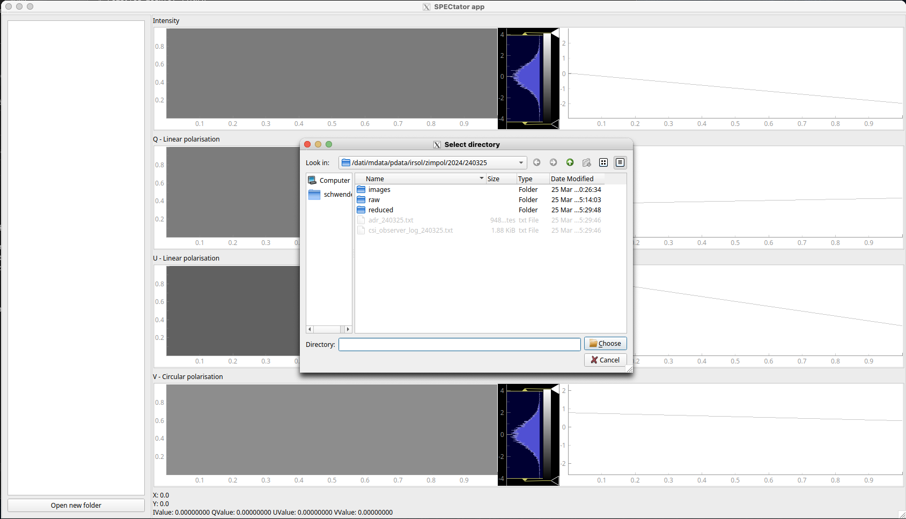
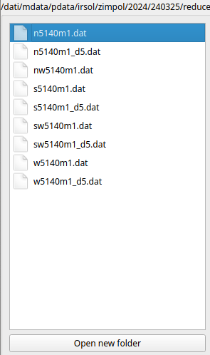
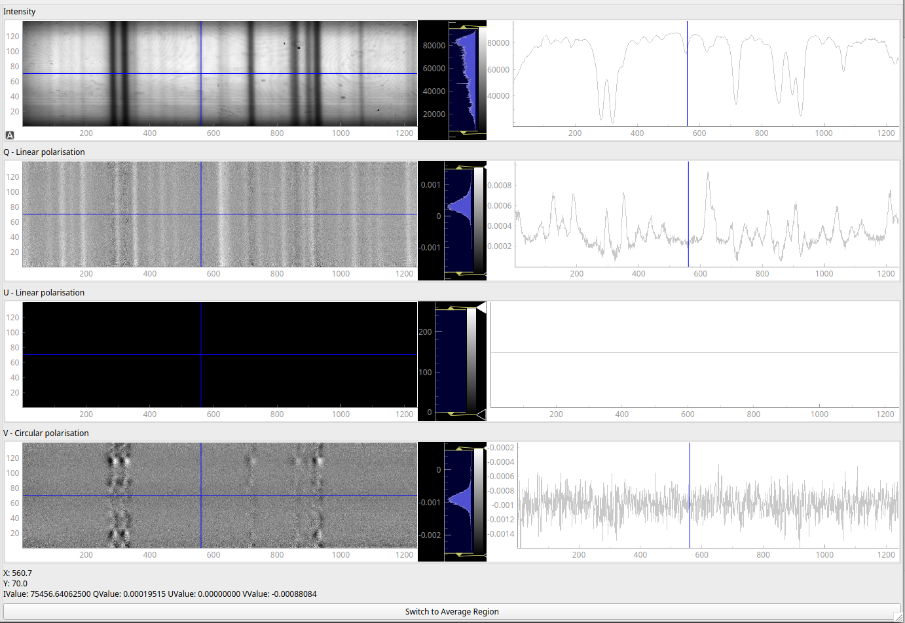
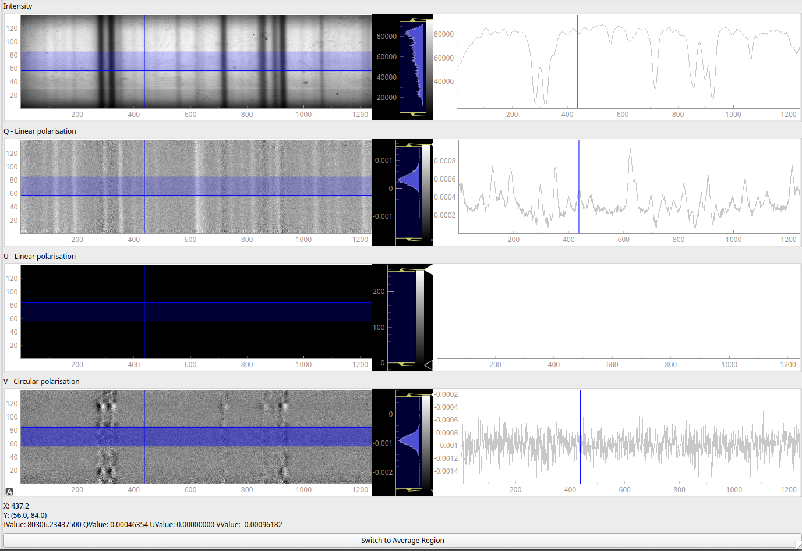
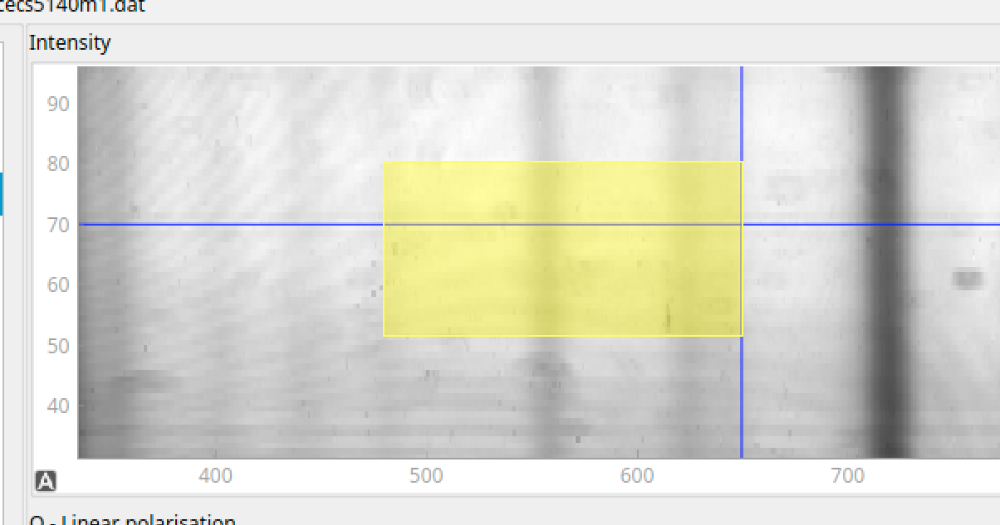

# Introduction

Python replacement for IDL Z3showred

## Index

- [About](#about)
- [Usage](#usage)
  - [Installation](#installation)
  - [Commands](#commands)
- [Development](#development)
  - [Developmen Environment](#development-environment)
  - [File Structure](#file-structure)
  - [Build](#build)
  - [Branches](#branches)
- [Credit/Acknowledgment](#creditacknowledgment)

## About

Project to implement a Python GUI to replace Z3showred for the display of the images taken with ZIMPOL.

## Usage

The application will then open a dialog to choose the images folder



Then select the file to open from the list on the left:



Mouse over on any left plot will display a vertical line which is aligned between all the plots.
Right plot shows the values taken from the horizontal line on the left plot.
The histogram in the middle can be used to change the minimum and maximum values.
All the values are displayed at the bottom of the application.
By clicking on the bottom button, the horizontal line switch to a linear region (results as average)



The regions line can be dragged to resize the minimum and maximum of the region.
The left plot can be “zoomed” and moved, either by scrolling with the mouse wheel or by selecting any range by dragging the mouse with the left click




### Installation

In order to install the application, you need to be enable on the following SCM project: [`spectator`](https://scm.ti-edu.ch/projects/spectator)

There are dependency with the following libraries:

```text
python=3.11
pyqtgraph
pyqt
scipy
pyinstaller
```

Which can be installed with the below Conda environment example:

```bash
conda create -n spectator python=3.11 pyqtgraph pyqt scipy pyinstaller
```

Source code can be pulled from the SCM repository by:

```bash
git clone https://scm.ti-edu.ch/repogit/spectator
```

### Commands

When inside the project folder:

```bash
python spectatorAPP.py
```

Or by executing the created package (saved in `/dist`):

```bash
spectatorAPP
```

The application can as well take the targer folder as argument.

## Development

### Development Environment

Make sure to have all the dependencies managed in [Installation](#installation)

### File Structure

```text
.
|-- README.md
|-- spectatorAPP.py
|-- controller
|   |-- includes
|   |   |-- dirProxyModel.py
|   |-- spectatorController.py
|-- model
|   |-- datReader.py
|-- view
    |-- fileListWidget.py
    |-- includes
    |   |-- histogram.py
    |   |-- meanGraph.py
    |   |-- spectBox.py
    |   |-- spectator.py
    |-- mainWindow.py
    |-- spectatorWidget.py
```

 Folder Name | Details
------------|-------
 controller | Connectores between `models` and `views`
 model | Used to manage data, in this case the images import
 view | Rendering of the information retrieved by `models` and `controllers`

### Build

You can build the related package (which is OS dependant) with the following command:

```bash
pyinstaller spectatorAPP.py --onefile
```

### Branches

1. **`development`** branch. For ongoing activities

2. **`master`** is the production branch

3. No other permanent branches should be created in the main repository, you can create feature branches but they should get merged with the development and then master

## Credit/Acknowledgment

Original version develop by [Denny Schwender](https://www.linkedin.com/in/denny-schwender/) during the Civil Service in the period april-may 2024
