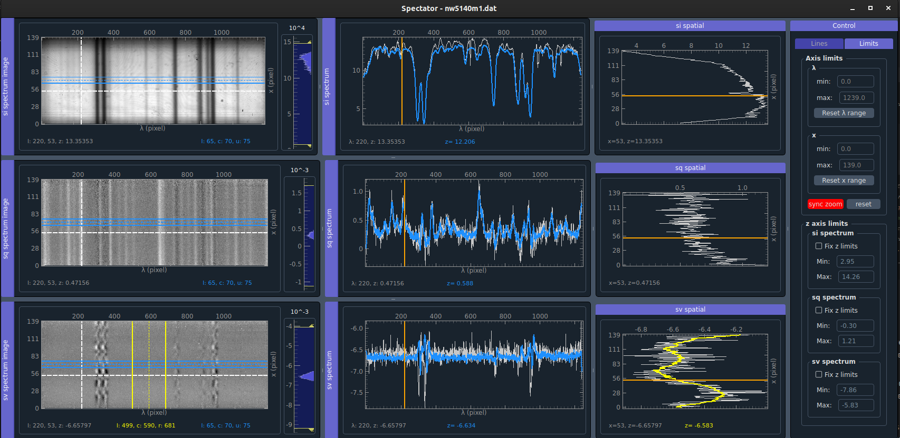
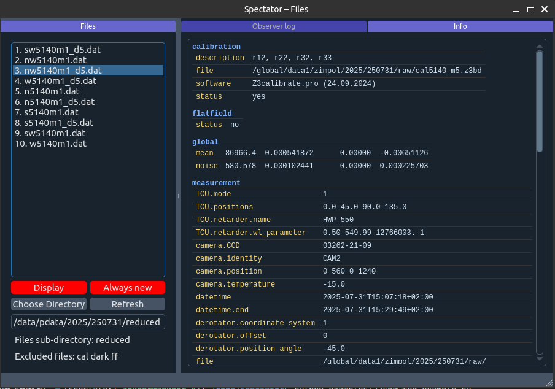

# Spectator - Spectropolarimetric Data Viewer

A Python-based visualization tool for multi-dimensional spectropolarimetric data, designed to replace IDL Z3showred.




## Installation

### End Users

For users who just want to install the package and use it programmatically:

```bash
# Install from GitHub with pip (not yet on PyPI)
[uv venv --python 3.14]
[uv] pip install git+https://github.com/fzeuner/spectator.git

# Or add to an existing project with uv
uv add git+https://github.com/fzeuner/spectator.git
```

Requirements: Python 3.14+

### z3showred Users

Follow below instructions to install z3showred - in case you want to install it on saturn/old instrument PCs, follow instructions on the branch os-old!

#### 1. Install uv

Follow the official guide: https://docs.astral.sh/uv/getting-started/installation/

#### 2. Clone and set up

```bash
git clone https://github.com/fzeuner/spectator.git ~/spectator
cd ~/spectator
uv sync
```

### 3. Configure data path

Copy the example config and point it to your data folder:

```bash
mkdir -p ~/.config/spectator
cp ~/spectator/config/file_config.json ~/.config/spectator/file_config.json
```

Then edit `~/.config/spectator/file_config.json` and set `default_data_base_dir` to your data root:

```json
{
  "default_data_base_dir": "/path/to/your/data"
}
```

### 4. Add alias

```bash
echo "alias z3showred='cd ~/spectator && ./z3showred.sh'" >> ~/.bashrc
source ~/.bashrc
```

Then simply run:

```bash
z3showred
```

### Developers

For contributors or those modifying the code:

**Prerequisites:**
- Python 3.14+
- [uv](https://docs.astral.sh/uv/) (modern Python package manager)

**Setup:**

```bash
# 1. Clone the repository
git clone https://github.com/fzeuner/spectator.git
cd spectator

# 2. Create virtual environment and install dependencies
uv sync

# 3. The package is now installed in editable mode
# Run an example to verify:
uv run python examples/viewer_example.py
```

**Development commands:**

```bash
# Run tests
uv run pytest

# Run an example
uv run python examples/scan_viewer_example.py

# Add a dependency
uv add <package-name>

# Update lock file after manual pyproject.toml changes
uv lock
```

## Usage

### Programmatic Usage

```python
from spectator.controllers.app_controller import display_data
import numpy as np

data = np.load('your_data.npy')  # shape: (states, spectral, spatial_x)

viewer = display_data(
    data,
    order=['states', 'spectral', 'spatial_x'],
    title='My Data',
    state_names=['I', 'Q', 'U', 'V'],
)
```

### Examples

```bash
# 3D viewer (states, spectral, spatial)
python examples/viewer_example.py

# 4D scan viewer (states, spectral, spatial_y, spatial_x)
python examples/scan_viewer_example.py

# File browser (Z3showred-style)
python examples/z3showred_example.py
```



## Features

- **Flexible data handling**: numpy arrays with configurable dimension semantics
- **Synchronized views**: crosshairs, zoom, and averaging lines sync across all windows
- **Spectral/spatial averaging**: interactive line-based region selection
- **Per-state scaling**: automatic optimization for each Stokes parameter
- **ZIMPOL support**: direct `.dat` file loading

## Configuration (ZIMPOL file browser)

Edit `~/.config/spectator/file_config.json` (local user config, location is defined in `utils/config.py` as `USER_CONFIG_DIR`/`USER_CONFIG_PATH`) (or `config/file_config.json` in repo):

```json
{
  "default_data_base_dir": "/path/to/your/pdata",
  "auto_navigate_recent": true,
  "must_be_in_directory": "reduced",
  "excluded_file_terms": ["cal", "dark", "ff"]
}
```

- `default_data_base_dir`: Base data directory path
- `auto_navigate_recent`: Auto-open most recent `YYMMDD` subdirectory
- `must_be_in_directory`: Filter paths containing this substring
- `excluded_file_terms`: Exclude files containing these terms

## Architecture

Spectator follows a **Model-View-Controller (MVC)** architecture pattern for maintainable and scalable code

## Acknowledgments

- **Franziska Zeuner**: Original concept, architecture, implementation
- **PyQtGraph team**: Plotting library
- **Claude Sonnet 4.5**: Development assistance
